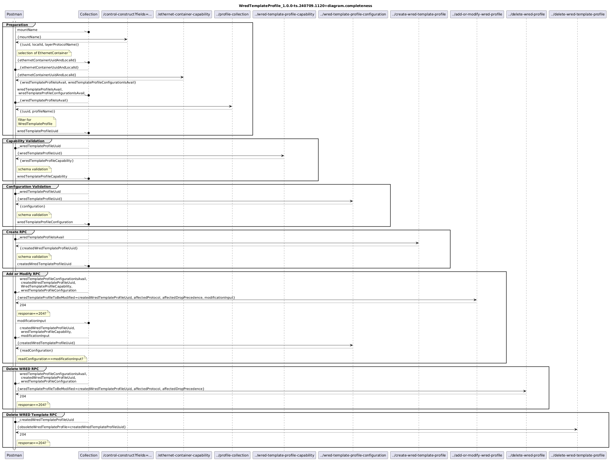

# WredTemplateProfile_1.0.0-ts.240709.1120+validator

### Completeness
- [WrTeProf_1.0.0-ts.240709.1120+validator.completeness](./Completeness/WrTeProf_1.0.0-ts.240709.1120+validator.completeness.json)  
- [WrTeProf_1.0.0-ts.240709.1120+data.completeness](./Completeness/WrTeProf_1.0.0-ts.240709.1120+data.completeness.json)  
-   
